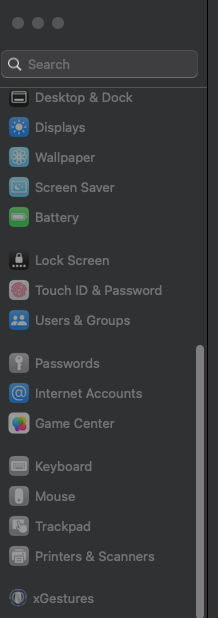
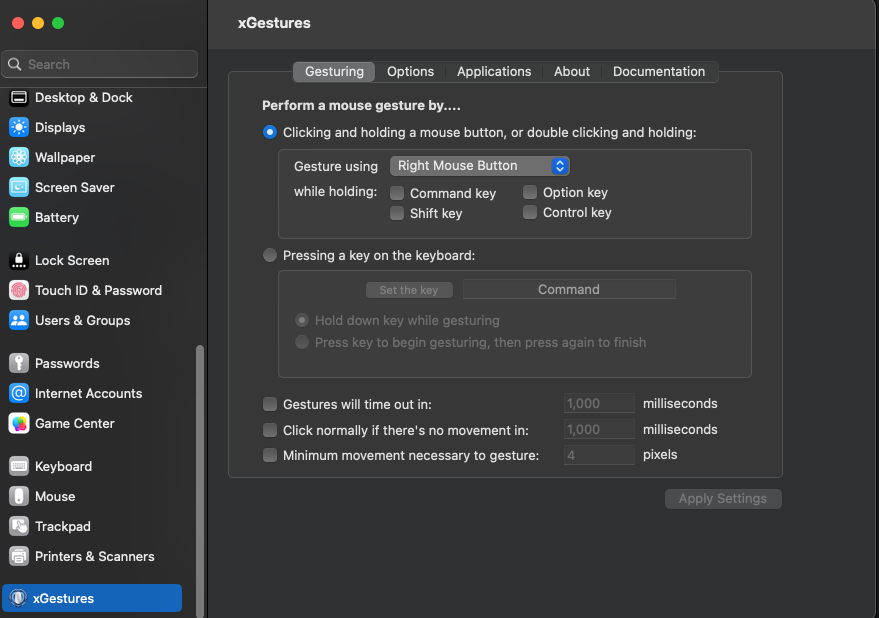
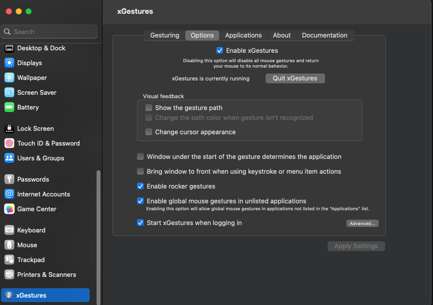

# mac-3-finger-gesture
Repository containing the instructions on how to setup the 3 finger gestures of macos on external (third-party) mouse

If someone have external mouse to work / interact with the MacOs and is missing the 3 finger gesture controls , so follow this repository. I will talk about setting up the basic 3 finger gestures on any external 3rd party mouse .

## NOTE

If you have the **Apple Magic Mouse** , then you dont need to follow this guide , as the **Apple Magic Mouse** already have all the gestures control as of the mac trackpad.

## Instructions

Follow the below mentioned instructions step by step in order to setup the 3 finger gestures control on any 3rd party external mouse.

* First , we need to install a third part software called **xGestures** , this is the main tool that will help in setting up the custom gestures
    
    * Follow this link for downloading the **xGestures** based on the MacOs version : http://briankendall.net/xGestures/download.htm

    * Download and Install it

    * This will add an additional menu in the **Settings** in the MacOs by the name of the **xGestures**

        * 

* Click on the **xGestures** settings

    * Open the first sub-menu named **Gesturing**

        * Under this , Select `Perform a mouse gesture by ...`

        * Select the `Gesture using` setting and select the value: `Right Mouse Button`

        * 

        * Keep the rest same as shown in the above added screenshot . Click on `Apply Settings`

* Now , move to the `Options` sub-menu , and

    * Click on `Enable xGestures` . If this kept unchecked or disabled , the xGestures wont work on the Mac

    * Make sure to confirm that below should be showing : `xGestures should be currently running` . If not , then click on the setting in front of it and Follow all the steps asked by the tool

    * Click on the `Enable rocker gestures` , `Enable global mouse gestures` and `Start xGestures when logging in` . This will make sure that xGestures will always run when we re-login to the mac back

    * Click on Apply settings

    * 

* Now , move to the `Applications` sub-menu . This is the most important setting as here we define how the custom shortcuts will work as the mac 3 finger gesture control

    * 
